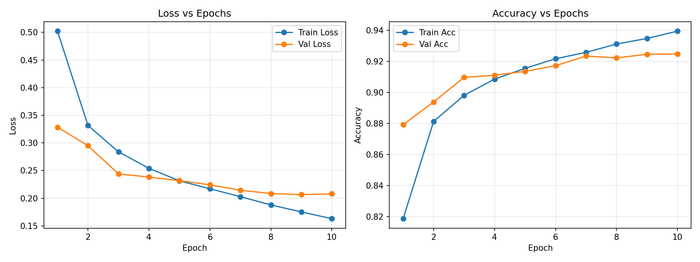
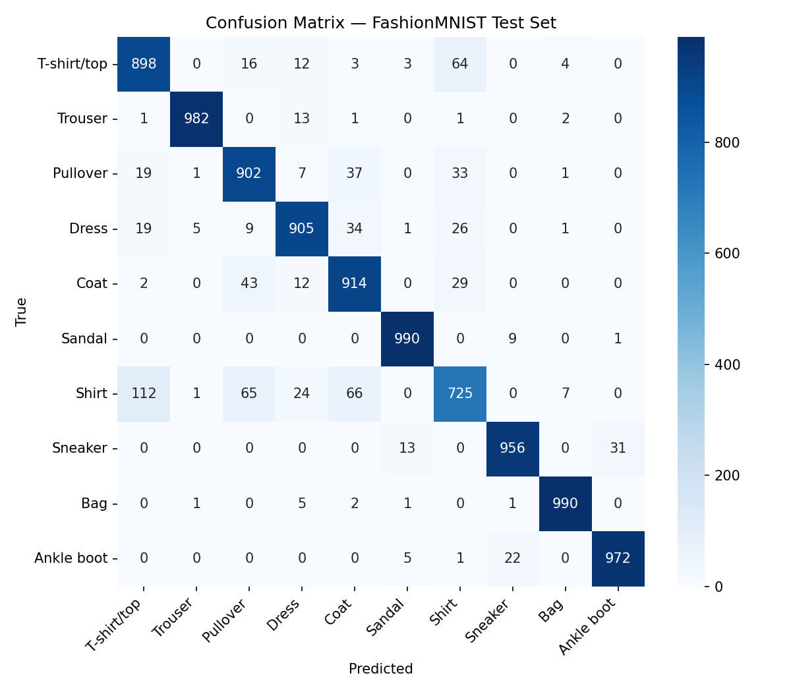
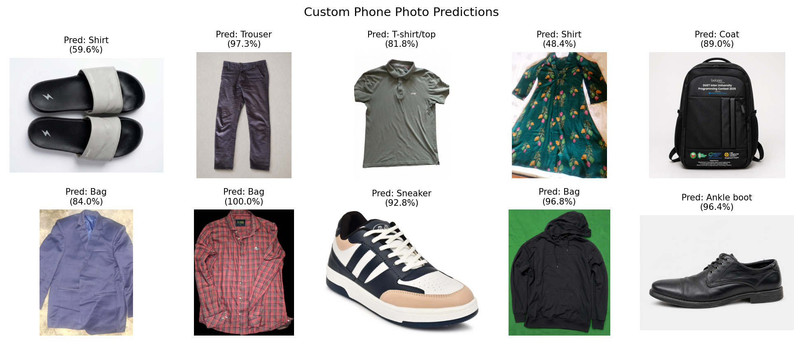
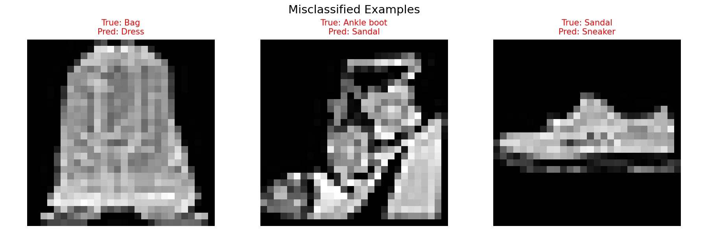

# CNN Image Classification — FashionMNIST

**Student:** Md. Ashadullah Al Galib
**ID:** 220138 (replace with your actual ID)

## Overview
A CNN trained on FashionMNIST (10 classes, 28×28 grayscale) and tested on 10 custom
smartphone photos of real clothing/footwear items.

## Repo Structure
```
├── dataset/          # 10 custom smartphone photos (jpg/png), one per class where possible
├── model/
│   └── 220138.pth    # saved trained model weights (state_dict)
├── 220138.ipynb       # Colab notebook — full pipeline
└── README.md
```

## Architecture
```
Input (1x28x28)
 → Conv2d(1→32, 3x3, pad=1) → ReLU → MaxPool2d(2)   # 14x14x32
 → Conv2d(32→64, 3x3, pad=1) → ReLU → MaxPool2d(2)  # 7x7x64
 → Flatten
 → Linear(64*7*7 → 128) → ReLU → Dropout(0.3)
 → Linear(128 → 10)
```

- **Loss:** CrossEntropyLoss
- **Optimizer:** Adam (lr=1e-3)
- **Epochs:** 10
- **Batch size:** 64

## Results
_Paste after running the notebook:_
- Final Train Accuracy: 94%
- Final Validation Accuracy: 92.8%
- Test Accuracy: 92.34%

### Training Curves


### Confusion Matrix


### Custom Photo Predictions


### Error Analysis


## How to Run
1. Open `220138.ipynb` in Google Colab.
2. Click **Runtime → Run All**.
3. The notebook auto-clones this repo for the 10 custom images — no manual upload needed.

## Colab Link
`<https://colab.research.google.com/drive/1nJDhFIBH1Wf_UZitp2pZq_TCgy4cMzYg?usp=sharing>`
